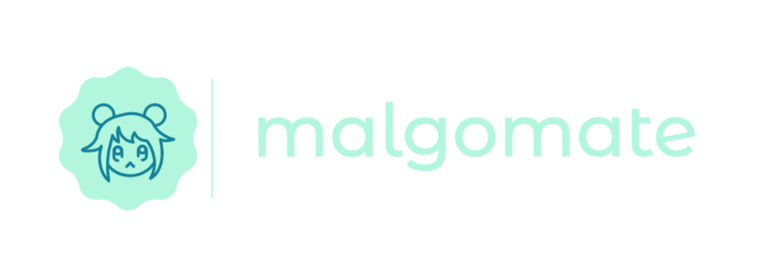

malgomate is a simple go library for the MAL (MyAnimeList) public API. It aims to be a light weight wrapper for making API calls, without a lot of bells and whistles. Grab the data, and do what you want with it.

malgomate does not aim to cover all aspects of the MAL API. It is not interested in user lists, updating of those lists, or any community aspects. It is purely for getting anime data out of MAL. If you are interested in having access to that kind of data, feel free to open an issue and contribute.

## Requirements

In order to use malgomate in your project, you will need to have registered an application in the MAL dev console and aquired an access token. You will need this token in order to make requests.

## Install

Add malgomate to your project by running:
```
go get github.com/fuzzylimes/malgomate@latest
```

## Usage

You can see some basic examples in the `it` folder. Nothing too exciting here:

```go
import mal "github.com/fuzzylimes/malgomate"

func TestListing(t *testing.T) {
	c := mal.NewClient(os.Getenv("MAL_API_KEY"))
	res, err := c.GetAnime(&mal.AnimeQuery{
		Query: "Naruto",
	})
	if err != nil {
		t.Errorf("Unexpected error: %q", err)
	}
}
```

## Support

As mentioned before, malgomate does not support all of the [MAL v2.0 API features](https://myanimelist.net/apiconfig/references/api/v2). Specifically, it only provides interfaces for the following queries:

* [GET Anime List](https://myanimelist.net/apiconfig/references/api/v2#operation/anime_get)
* [GET Anime Details](https://myanimelist.net/apiconfig/references/api/v2#operation/anime_anime_id_get)
* [GET Anime Ranking](https://myanimelist.net/apiconfig/references/api/v2#operation/anime_ranking_get)
* [GET Seasonal Anime](https://myanimelist.net/apiconfig/references/api/v2#operation/anime_season_year_season_get)

### What does malgomate mean?

Nothing - made up word that I thought sounded interesting, that also happened to contain both `MAL` and `GO`.

## TODO List

[ ] Handle nested queries for QueryFields<br>
[ ] Handle nested queries for DetailFields